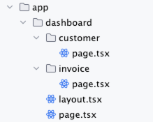

# Dashboard

- Create the dashboard routes using file-system routing.
- Understand the role of folders and files when creating new route segments.
- Create a nested layout that can be shared between multiple dashboard pages.
- Understand what colocation, partial rendering, and the root layout are.


## Make Router Work



```tsx
export default function Page(){
    return (
        <div>
            <Link href="/dashboard/customer"
                  className="flex items-center gap-5 self-start rounded-lg
                      bg-blue-500 px-6 py-3 text-sm font-medium
                      text-white transition-colors hover:bg-blue-400 md:text-base"
            >
                <span>customer</span> <ArrowRightIcon className="w-5 md:w-6"/>
            </Link>

            <Link href="/dashboard/invoice"
                  className="flex items-center gap-5 self-start rounded-lg
                      bg-blue-500 px-6 py-3 text-sm font-medium
                      text-white transition-colors hover:bg-blue-400 md:text-base"
            >
                <span>invoice</span> <ArrowRightIcon className="w-5 md:w-6"/>
            </Link>
        </div>
    )
}
```

```tsx

export default function Page(){
    return (
        <div>
            <p>Customer Page</p>
        </div>
    )
}
```

